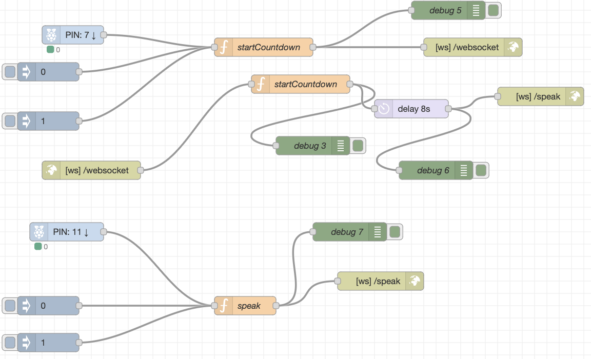
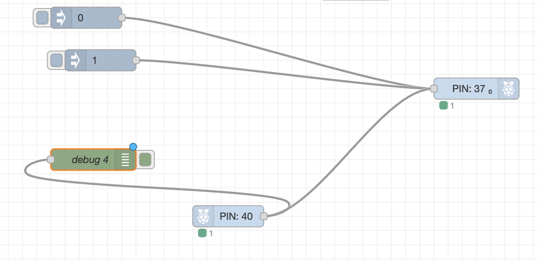

# Mirror Mind

Mirror Mind is een interactieve installatie die ontworpen is om het mentale welzijn te verbeteren. Wetenschappelijk onderzoek heeft aangetoond dat hardop praten tegen jezelf kan helpen om je gedachten op een rijtje te krijgen. Door je gedachten verbaal uit te spreken, kun je je beter concentreren en je gedachten beter organiseren. Dit is vooral nuttig omdat onze geest vaak gevuld is met talloze ideeën en gedachten. Door een gedachte hardop uit te spreken, kunnen we de essentiële zaken scheiden van de bijzaken.

De Mirror Mind-installatie is gebaseerd op dit concept en stelt je in staat om met jezelf te communiceren met behulp van artificiële intelligentie (AI). Het proces begint met het nemen van een foto van jezelf in een kleine ruimte, waarna je naar een grotere ruimte gaat waar je oog in oog komt te staan met je eigen spiegelbeeld. Hier kun je een vraag stellen aan jezelf om te reflecteren, waardevol advies te krijgen of nieuwe ideeën op te doen. Het systeem geeft antwoord op je vraag met behulp van AI en leest het antwoord vervolgens hardop voor.

Het visuele aspect is ook van groot belang in dit concept. Je ziet jezelf in de spiegel en ziet je mond bewegen terwijl het antwoord wordt gegeven en voorgelezen. Dit creëert een totaalervaring waarin je innerlijke rust kunt vinden door in contact te komen met jezelf. Het algemene doel van Mirror Mind is om een positieve invloed op je mentale toestand te hebben door zelfreflectie, zelfbegeleiding en het stimuleren van nieuwe gedachten en perspectieven.


https://github.com/bootjesas/Mirror-Mind/assets/118461271/abae99fe-04e0-494d-b44c-2d5157c172fe


## Instructies 

### benodigdheden: 
- computer
- raspberrypi
- display (2)
- Camera
- Microfoon
- luidspreker 
-HDMI kabel (2)
- Drukknoppen (2)


### Stappenplan code:

#### Stap 1: Starten van de GitHub-code van LearnWebCode

Om te beginnen, kun je de GitHub-code van LearnWebCode gebruiken als basis voor je project. Je kunt de code vinden op de volgende link: [basis code](https://github.com/LearnWebCode/gpt-nextjs-example).
Zorg ervoor dat je een API-sleutel van DALL·E hebt, aangezien je hiermee API-verzoeken kunt doen voor de tekst-naar-afbeeldingfunctionaliteit. Houd er rekening mee dat dit een betaalde service is en dat je mogelijk moet betalen voor het gebruik ervan.

#### Stap 2: Taalinstellingen wijzigen en automatisch antwoord genereren

Om de taalinstellingen aan te passen, open je het bestand waarin de spraakherkenning en -generatie plaatsvindt. Vervang alle voorkomens van "en" en "EN" door "nl" en "NL" om de taal naar het Nederlands te wijzigen.
Om een automatisch antwoord te genereren zonder op een knop te drukken, kun je een functie toevoegen die kan detecteren wanneer je stopt met spreken. Deze functie kan worden geactiveerd door een timeout in te stellen na een bepaalde periode van inactiviteit in het spraakherkenningssysteem.

#### Stap 3: Text-to-speech-functionaliteit toevoegen

Om de gegenereerde antwoorden uit te spreken, kun je gebruikmaken van de Text-to-Speech (TTS)-functionaliteit die standaard beschikbaar is in de Google Chrome-browser. Houd er rekening mee dat andere browsers zoals Firefox, Safari en Edge mogelijk geen ondersteuning bieden voor deze functionaliteit. Bovendien kan het zijn dat de TTS-functionaliteit niet werkt op apparaten zoals Raspberry Pi met Chromium. In dergelijke gevallen kunnen geen antwoorden worden gegenereerd.

#### Stap 4: Toevoegen van een foto van jezelf met een bewegend mondje

Om een foto van jezelf met een bewegend mondje toe te voegen, moet je wijzigingen aanbrengen in de code. In plaats van alleen een indexpagina te hebben, kun je een aparte pagina maken genaamd "capture" waarin je een foto kunt maken met behulp van een canvas-element. Nadat de foto is gemaakt, sla je deze op in de openbare map van je project.
Je kunt ook een timer toevoegen om de foto automatisch te maken na een bepaalde tijd. Dit kan worden gedaan met behulp van een setTimeout-functie. Je kunt ook CSS-styling toepassen om een ovaal met een streepje te tonen, zodat je de positie van je hoofd kunt bepalen bij het maken van de foto.

#### Stap 5: Tonen van de foto op de indexpagina

Na het maken en opslaan van de foto in de openbare map, kun je deze foto ophalen en weergeven op de indexpagina. Dit kan worden gedaan met behulp van de drawImage-functie om de foto op een canvas-element te plaatsen. Je kunt de drawImage-functie aanroepen met de juiste parameters om de foto op de gewenste positie en grootte weer te geven.

#### Stap 6: Toevoegen van een bewegend mondje

Nadat de foto op het canvas is geplaatst, kun je een kleine rechthoek op het canvas tekenen. Dit kun je doen door coördinaten te specificeren en het canvas op die positie vast te leggen. Vervolgens kun je met behulp van variabelen en een setTimeout-functie de rechthoek op en neer laten bewegen op de positie waar de mond zich bevindt. Op deze manier lijkt het alsof het mondje op en neer beweegt terwijl het praat.

#### Stap 7: Beweging van de mond alleen activeren tijdens het voorlezen

Om ervoor te zorgen dat de mond alleen beweegt tijdens het voorlezen van het gegenereerde antwoord, kun je een functie aan de code toevoegen. Deze functie wordt pas gestart nadat het antwoord is gegenereerd. Het stoppen van de beweging is echter lastiger, omdat de code niet automatisch weet wanneer het antwoord volledig is gegeven en kan stoppen. In dit geval hebben we zelf geen oplossing geïmplementeerd.

#### Stap 8: Vervangen van de camera- en spraak opname knoppen door een drukknop via Raspberry Pi

Om de knoppen voor het maken van een foto en het opnemen van een vraag te vervangen door een drukknop via Raspberry Pi, kun je websockets gebruiken. Je kunt de functies van de knoppen koppelen aan een websocket die via Node-Red draait. Op deze manier kun je de drukknop gebruiken om de gewenste functionaliteit te activeren.




#### Stap 9: Automatisch vernieuwen van de pagina na het maken van een nieuwe foto

Om ervoor te zorgen dat de indexpagina automatisch vernieuwt en de nieuwe foto weergeeft zonder handmatig te hoeven verversen, kun je ook een websocket gebruiken. Je kunt de websocket verbinden met de drukknop van de camera en deze doorgeven wanneer er een nieuwe foto is gemaakt. Op basis van deze melding kan de pagina automatisch worden vernieuwd om de nieuwe foto te tonen.
Met deze stappen zou je code compleet moeten zijn.





## instaleren 
### zeker niet vergeten 
Voer 'npm install ' uit in je terminal om de modules te instaleren.

gebruik `npm run dev` om lokaal @ `localhost:3000` te hosten. Of gebruik `npm run build` en vervolgens `npm run start` om een voorbeeld van de openbare build te bekijken. Ga naar een gratis Vercel-account om het te hosten en met de wereld te delen.

Maak een API key aan via de site [API KEY](https://platform.openai.com/account/api-keys) en plaats deze in de env folder 
!! LET OP !! zorg dat deze API key nooit online komt.


## uitleg code  
### Websocket 
```javascript
ws.onmessage = function (msg) {
  console.log(msg)
  console.log(msg.data);
  if (msg.data === 'capture') {
    setImageCount(imageCount+1)
    window.location.reload();
  } else if (msg.data === 'speak') {
    handleSpeech();
  }
}
```

Dit fragment behandelt het onmessage-event van de WebSocket. Wanneer er een bericht binnenkomt, wordt de ontvangen boodschap (msg) gelogd. Vervolgens wordt de data van het bericht gelogd. Als de data gelijk is aan 'capture', wordt de imageCount verhoogd met 1 door setImageCount(imageCount+1) aan te roepen. Daarna wordt de pagina herladen met window.location.reload(). Als de data gelijk is aan 'speak', wordt de functie handleSpeech() aangeroepen.

### Image
```javascript
function drawImage() {
  const canvas = canvasRef.current;
  const img = imgRef.current;
  const ctx = canvas.getContext("2d");

  canvas.width = 800;
  canvas.height = 600;

  console.log('aaa');
  console.log(img);
  // Teken de afbeelding op canvas2
  ctx.drawImage(img, 0, 0, 800, 600, 0, 0, 800, 600);
  canvas.style.display = "block"; // maak #canvas2 zichtbaar}
  ```


Deze functie, drawImage, wordt gebruikt om een afbeelding op het canvas te tekenen. Het krijgt toegang tot het canvas-element (canvasRef.current), het img-element (imgRef.current) en de canvas-context (ctx). Vervolgens wordt de breedte en hoogte van het canvas ingesteld op 800x600 pixels. Daarna wordt de afbeelding getekend op het canvas met behulp van de drawImage-methode van de canvas-context. De afbeelding wordt getekend op de coördinaten (0, 0) van het canvas en wordt geschaald naar een grootte van 800x600 pixels.

### Countdown
```javascript
const startCountdown = () => {
    let timer = 5;
    setCountdown(timer);

    const interval = setInterval(() => {
      timer--;
      setCountdown(timer);
      if (timer === 0) {
        clearInterval(interval);
        capture();
      }
    }, 1000);
  }
const handleCaptureButtonClick = () => {
    startCountdown();
  }
```
Na een druk op de knop wordt er een countdown gestart die van 5 naar 0 gaat.

### Capture

```javascript
const startCountdown = () => {
    let timer = 5;
    setCountdown(timer);

    const interval = setInterval(() => {
      timer--;
      setCountdown(timer);
      if (timer === 0) {
        clearInterval(interval);
        capture();
      }
    }, 1000);
  }
```
Als de timer 0 bereikt wordt er een foto gemaakt.


### Doorsturen 

```javascript 
const capture = () => {
    // Maak de canvaselementen even groot als de videoresolutie
    canvasRef.current.width = videoRef.current.videoWidth;
    canvasRef.current.height = videoRef.current.videoHeight;
    // Teken de video op het canvas
    canvasRef.current.getContext('2d').drawImage(videoRef.current, 0, 0);


 
    setShowingFeedback(true);
    setCountdown(null);

    // save image
    const dataUrl = canvasRef.current.toDataURL('image/png');
    fetch('/api/save-image', {
        method: 'POST',
        body: JSON.stringify({ image: dataUrl }),
        headers: {
          'Content-Type': 'application/json'
        }
      })
        .then(response => response.json())
        .then(data => {
          //socket.send("capture");
          console.log(data)
        })
        .catch(error => console.error(error));

    setTimeout(()=> {
      setShowingFeedback(false);
    },10000);
  }
  ```

  In dit stuk wordt de foto visueel gemaakt en worden de afbeeldingsgegevens doorgestuurd. Na 10 seconden verdwijnt de foto zodat er weer een nieuwe gemaakt kan worden.
  
  
  ### Websocket doorsturen
  ```javascript
  useEffect(()=> {
    console.log("useeffect");
    //const WebSocket = require('ws')
      function wsConnect() {
      console.log("wsConnect");
      ws = new W3CWebSocket('ws://192.168.100.1:1880/websocket');
    
      ws.onmessage = function (msg) {
        if (msg.data === "startCountdown") {
          startCountdown();
          console.log(msg);
          ws.send("capture");
        }
      }

      ws.onopen = function () {
        console.log("Connected");
      }

      ws.onclose = function () {
        setTimeout(wsConnect, 3000);
      }

      ws.disconnect = function () {
        console.log("Disconnected");
      }      
}

wsConnect();
```

Hier wordt er een websocket aangemaakt die er voor zorgt dat er real-time berichten kunnen verstuurd of ontvangen worden. Zo kan de afbeelding worden verzonden via een externe server.

### Annimatie
```javascript
function startAnimation() {
      
      // Handmatig invoeren van de coördinaten van de rechthoek
      const x = 220;
      const y = 315;
      const width = 200;
      const height = 140;

      // Animatie van de uitgesneden rechthoek
      let offset = 0;
      let direction = "omhoog";

      animationInterval = setInterval(() => {
        const canvas = canvasRef.current;
      const img = imgRef.current;
      const ctx = canvas.getContext("2d");
        // Teken een deel van de afbeelding in de rechthoek
        ctx.clearRect(x, y, width, height);
        ctx.drawImage(
          img,
          x,
          y + offset,
          width,
          height, // broncoördinaten
          x,
          y,
          width,
          height // doelcoördinaten
        );
        // Pas de offset aan om de positie van de tekening te veranderen
        if (direction === "omhoog") {
          offset = offset - 1;
          if (offset < -7) {
            direction = "omlaag";
          }
        } else {
          offset = offset + 1;
          if (offset > 0) {
            direction = "omhoog";
          }
        }
      }, 50);
    }
    function stopAnimation() {
      clearInterval(animationInterval)
    }
```
Deze code laat een knipsel van de mond op en neer bewegen.

### spraak
```javascript 
async function handleSubmit(transcript) {
    console.log(transcript)
    setIsLoading(true);
    console.log(transcript);
    const response = await fetch("/api/get-answer", {
      method: "POST",
      headers: {
        "Accept": "application/json",
        "Content-Type": "application/json"
      },
      body: JSON.stringify({ prompt: transcript })
    });
    const data = await response.json();
    answer = data.text.trim();
    const translatedAnswer = await translateToDutch(answer);
    answer = translatedAnswer;
    setIsLoading(false);

    // Use the Web Speech API to speak the answer out loud with a scary voice
   // Use the Web Speech API to speak the answer out loud with a normal voice
   const utterance = new SpeechSynthesisUtterance(answer);
   utterance.pitch = 1; // Normal pitch
   utterance.rate = 1; // Normal speed
   utterance.volume = 1; // Loud volume
   speechSynthesis.speak(utterance);
   

    startAnimation();
  }
  ```
Hier wordt wordt de spraak toegevoegd en worden er instellingen voor de stem meegegeven. Zodra de speech start, wordt ook de animatie van de mond gestart.


# houtconstructies 


### OPBOUW

Vorm vier kaders van 110 cm bij 210 cm, twee kaders van 90 cm bij 210 cm, één kader van 100 cm bij 210 cm (D) en één kader van 160 cm bij 210 cm (E). Plaats scharnieren tussen twee van de kaders van 110 cm bij 210 cm (A). Herhaal dit voor de andere twee van dit formaat (B) en voor de kaders van 90 cm bij 210 cm (C). Bevestig twee balken van 200 cm aan elkaar met een scharnier voor het dak, en herhaal dit nog een keer.Schroef de kaders A vast aan kader D en de kaders B en E aan C. Plaats een tafel in de inham van de kaders A en D en bevestig hier een kartonvel van 220 cm bij 210 cm tegenaan. Snij een gat op hoofdhoogte en daaronder een gat op maat van een drukknop in het grote kartonvel. Vouw de lange balken van 200 cm open en plaats ze bovenop de constructie. Bedek de gehele constructie met tuidoeken om het volledig te verduisteren.


### INDELING
Plaats een groot scherm en een houten paaltje in de grote ruimte. Voorzie een gat in het paaltje op maat van een drukknop. Plaats een monitor en een webcam in de kleine ruimte en zorg ervoor dat de webcam op de hoogte van het gat in het karton staat.Voorzie een tafel achter de constructie waar alle elektronica naartoe wordt geleid en gekoppeld aan de Raspberry Pi. Bevestig een microfoon aan het plafond voor het grote scherm.


